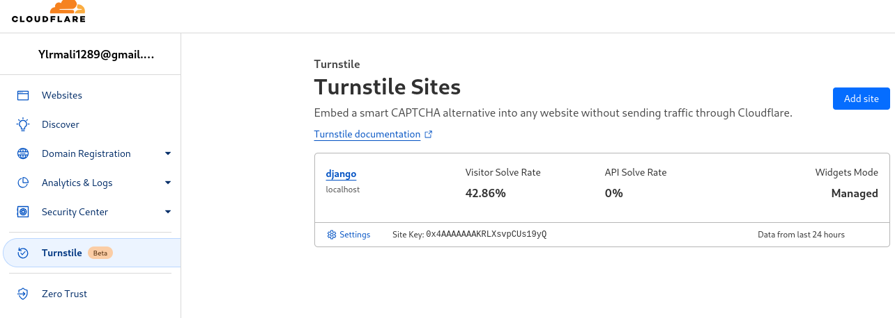

# DJANGO TIPS

## VIEWS

Bu kısımda template leri yükleriz(renderlarız) database işlemlerini ve daha fazla işlemleri yaparız. 

import edilmesi gerekenler: 

```python
from django.shortcuts import render
# html sayfası yüklemek için yeterli olsa da daha farklı methodlar da kullanırız.
from django.shortcuts import redirect # belirli bir linke yönlendirme yapar
from django.http import HttpResponse # belirtilen texti renderlar
```

Bir fonksiyonun render methodu ile beraber html sayfası render etmesi:

```python
def home(request):
    return render(request, 'mainapp/home.html')

# python daki fonksiyonun aynısını kullanırız.
# ve bu fonksiyon request parametresini almasi gerekir.
# Bu request nesnesi, gelen HTTP isteğiyle ilgili tüm bilgileri içerir, 
		#	örneğin istek metodu (GET, POST vb.), istek URL'si,
		# istek başlıkları, istek verileri (form verileri, JSON verileri vb.) ve daha fazlası.
# ayrıca bu fonksiyonlar mutluka bir httpresponse return etmeli. ( yani render, redirect,HttpResponse vb...)
# render methodu ilk olarak request parametresini alır.
# daha sonra templates içindeki html dosyalasını belirtiriz.
# benim örneğimde templates altında uygulama adında bir klasör açtığım için bu şekilde belirttim(önerilen şekil)

```


bir fonksiyonu redirect methodu ile birlikte kullanma:

```python
def hakkımızda(request):
	return render(request, 'hakkımızda.html')

def redirectHakkımızda(request):
	return redirect('/hakkımızda')

	# link olarak 127.0.0.1:8000/hakkımızda yüklenecektir.
	# urls.py da belirtilen views.hakkımızda fonskiyonu calısacaktır.
	# yani hakkımızda.html sayfası renderlanacaktır.
```

bir fonksiyonu HttpResponse ile birlikte kullanma:

```python
def hello(request):
	return HttpResponse('Hello Worl!')

# home url pathine ulaşıldiğında views.hello fonksiyonu calısacaktır.
# ve bize sadece Hello World yazısı gösterilecektir.
```

### *View’ de Html Sayfasına Context(Bağlam) Gönderme*

Bir context göndermek için render methoduna ihtiyacımız var. Redirect ve diğerleriyle de gönderebiliriz ama onlarda işlem biraz daha farklı ve zahmetli.

Ayrıca göndereceğimiz contex mutlaka dictionary tipinde olmalıdır. Yoksa hata alırız.

```python
 def sendContext(request):
		# bu sekilde kullanımı yanlış değil ama kısıtlı bir yöntem
		return render(request, 'contextPage.html', {'message': 'Hello Worl'})
		context = {
					'message': 'Hello World',
					'name': 'Ali Yıldırım',
					'user': request.user, # oturum açmış kullanıcıyı belirtir.
				}
		return render(request, 'contextPage.html', context)
		# bu yöntem ile daha düzenli bir formda daha fazla bilgi gönderebiliriz.
```

```html
<html>
...
<body>
			<h1> **{{ message }}** </h1>
			<h3 class='name'> **{{ name }}** </h3>
			<p> **{{ user }}** </p> 
</body>
...
</html>
```

## URLS

Urller arama kısmına [localhost](http://localhost) ve portu yazdıktan sonra ‘/’ dan sonra yazılan bir değerde hangi fonksiyonun ya da class’ın çalışacağını belirttiğimiz kısım. Urller ikiye ayrılır: 

1. Proje urls.py
    
    ***Bu dosya proje oluşturduğumuzda otomatik olarak gelir. Bu kısma uygulamalarımızın urls.py dosyasını dahil etmemiz gerekir.***
    
    ***Bunun için öncelikle include methodunu import etmeliyiz.***
    
    ```python
    from django.urls import path, include
    ```
    
    ***daha sonra path’ ımızı oluşturmalıyız. Ve oluşturduğumuz path içerinde app [urls.py](http://urls.py) dosyasını include etmeliyiz.***
    
    ```python
    path('', include('deneme.urls')),
    # path içindeki ilk kısım url'mizin alacağı ön eki temsil eder.
    # ikinci kısımda include ile uygulama adını yazarız ve daha sonra urls yazarız.
    # bu şekilde deneme adındaki uygulamamızın urllerini projemize dahil etmiş olduk.
    ```
    
2. Uygulama urls.py 
    
    ***Bir uygulama oluşturduğumuzda [urls.py](http://urls.py) dosyası hazır olarak gelmez. Bizim oluşturmamız gerekir. Uygulama dizininin altında bir urls.py dosyası oluşturduktan sonra alttakileri import etmemiz gerekir.***
    
    ```python
    from django.urls import path
    from deneme import views  # views.py içindeki fonksiyonlarımızı dosyamıza dahil ettik
    ```
    
    ***Daha sonra urlpatterns içinde pathlerimizi tanımlamalıyız.***
    
    ```python
    urlpatterns = [
        path('', views.home, name='home'),
        path('hakkımızda', views.hakkımızda, name='hakkımızda'),
    		path('iletisim', views.iletisim, name='iletisim'),
    ]
    # path'ın ilk kısmında proje urls.py dosyasında belirttigimiz deneme.urls 'in ön ekinden sonra gelicek eki belirtir.
    # Örneğin urls.py da ekimiz yok ve hakkımzda pathında hakkımızda eki var. Bu sayfayı yüklemek için:
    # 127.0.0.1:8000/hakkımızda linkine gitmemiz gerekir.
    # Eğer proje url dosyasında buna bir ek verseydik -> denemeapp olsun
    # 127.0.0.1:8000/denemeapp/hakkımızda şeklinde ulaşabilirdik.
    # ikinci kısımda views.py dosyasının içindeki hangi fonksiyonun çalısacagini belirtiriz.	
    # son kısımda ise bu url'ye daha sonra ulaşabilmek için bir isim veriyoruz.
    ```
    
    ***Belirtilen url'ye html sayfası içinde şu şekilde ulaşılabilir.***
    `` → bir a(link) içinde href özelliğine eklenir genellikle.
    
    ```css
    <a class='home-link' href=''> Anasayfa Yönelt </a>
    ```
    
    NOT:
    
    Eğer bu şekilde bir linke ulaşmaya çalışıp bu hatayı alırsan: 
    
    
    
    1. uygulamanın altındaki [urls.py](http://urls.py) dosyasına gelip bir name özelliği ekle
    2. proje [urls.py](http://urls.py) dosyasına gelip uygulamanın path’ıne namespace ekle
    
    ```python
    name = 'deneme' # uygulama adını yaz
    ```
    
    ```python
    path('', include(('mainapp.urls', 'mainapp'), namespace='mainapp')),
    # mainapp yerine kendi uygulamanın adını yazacaksın.
    ```
    
    
    
    
    
    Daha fazla bilgi için → [https://docs.djangoproject.com/en/4.1/ref/urls/](https://docs.djangoproject.com/en/4.1/ref/urls/)
    

## MODELS

Oluşturduğumuz app içinde hazır olarak gelen [models.py](http://models.py) dosyasının içinde database işlemlerimizi gerçekleştiririz. İmport edilmesi gereken:

`from django.db import models` → modellerimizi yazabilmemiz için gerekli (default olarak gelir)

```python
from django.db import models

class Kullanici(models.Model):
    kullanici_adi = models.CharField(max_lenght=100, unique=True)
		isim = models.CharField(max_lenght=100)
		soyisim = models.CharField(max_lenght=100)
		email = models.EmailField()
		sifre = models.TextField() # şifreler hiçbir zaman düz string şeklinde tutulmamalı. Kriptolama işlemi yapılmalı
		tel_no = models.BigIntegerField(unique=True, blank=True, null=True)
		dogum_tarihi = models.DateField(blank=True, null=True)
		aktif_mi = models.BoolenField(default=True)
		son_aktif_tarihi = models.DateTimeField(auto_now=True, editable=False)
		oluşturulma_tarihi = models.DateTimeField(auto_now_add=True, editable=False)
```

- Models

`models.CharField` → database’ e bir karakter dizisi kaydetmemize yarar. Ve mutlaka max_lenght özelliği belirtilmesi gerekir.

`models.EmailField` → database’e bir email kaydetmeye yarar. CharField ya da TextField da kullanılabilir.

`models.TextField` → sınır belirtmemize gerek kalmadan bir text alanı olusturur.

`models.BigIntegerField` → çok yüksek değerli sayıları saklamamızı sağlayan bir alan oluşturur. Eğer saklamak istediğimiz sayı çok büyük değilse IntField kullanılabilir.

`models.DateField`  → ay gün yıl şeklinde bir veri saklamamızı sağlar.

`models.DateTimeField` → ay gün yıl ve ekstra olarak saat verilerini saklamamıza yarar.

`models.BoolenField`  → True ya da False boolen değerlerini saklamamıza yarar.

- Özellikler

`max_lenght` → makmimum kaç karakter uzunluğunda olabileceğini belirler.

`unique` → database’e kayıt edilecek  her alakalı verinin birbirinden farklı olması gerektiğini anlatır.

`blank`  → bir değerin boş olup olamayacağını belirler. True verildiği durumda boş olabilir. Genellikle *null* ile beraber kullanılır. 

`null` → bir değerin none değer alıp alamayacağını belirler.

```python
tel_no = models.BigIntegerField(unique=True, blank=True, null=True)
# hiçbir şey yazmazsak database' de null olarak kayıt edilir.
```


`default` → bir verinin başlangıçta ne değer almasını isteğimizi belirtiğimiz kısım.

`auto_now` → otomatik olarak şuan ki durumu sürekli günceller.

`auto_now_add` → başlangıçta otomatik olarak şuan ki tarihi ekler ve bir daha güncellemez.

`editable` → admin panelinde belirtilen field’ ın düzenlebilir olup olmadığını belirtir.

Daha fazla bilgi için → [https://docs.djangoproject.com/en/4.1/topics/db/models/](https://docs.djangoproject.com/en/4.1/topics/db/models/)

Daha detaylı bilgi → [*https://docs.djangoproject.com/en/4.2/ref/models/fields/*](https://docs.djangoproject.com/en/4.2/ref/models/fields/)

## DATABASE QURIES

`ModelName.objects.filter(id=id)`  → database’den objeleri sadece belirtilen filtre dahilinde almak 

`ModelName.objects.get(id=id)`  → database’den belirtilen objeleri almak

`ModelName.objects.create(*args)`  → belirtilen database’e yeni bir bilgi oluşturmak(only create)

`ModelName.save()` → belirtilen database’e yapılan değişiklikleri kaydeder.  

`ModelName.objects.filter(id=id).update(name=’asd’)` → belirtilen database’de name field’ını günceller. Sadece name ile kısıtlı değildir. Belirtilen field’i günceller.

`ModelName.objects.add(**kwargs)` → yeni bir obje oluşturmamıza olanak sağlar.

`ModelName.objects.remove(id=1)` → id numarası 1 olan objeyi database’den siler.

`ModelName.objects.delete(id=1)` → id numarası 1 olan objeyi database’den siler.


get query örneği


get query örneği


filter query örneği

Daha detaylı bilgi → [*https://docs.djangoproject.com/en/4.1/topics/db/queries/](https://docs.djangoproject.com/en/4.2/topics/db/queries/)*  

## FORMS

Formlar bizim için kolaylık sağlayan araçlardır. Kullanabileceğimiz iki form tipimiz var: `forms.Form` ve `forms.ModelForm.` Eğer models.py yani Modelimizde upload işlemi yapacaksak(FileField, ImageField), ModelForm'ları kullanmalıyız. Ayrıca ModelForm’lar bize az kodla işlevsel formlar oluşturmamıza yardımcı olur.

***forms.Form***

Bu kısımda forms altında models in altındaki çoğu şey mevcut. Ve aynı işlevi yerine getiriyorlar.

Örnek: `forms.CharField`, `forms.TextInput`, `forms.ChoiceField`

```python
from django import forms

class UserForm(forms.Form):
			name = forms.CharField(label='Your Name', max_lenght=100) #bu kısımdaki label html de oluşturulan label ile aynı şey. Label içine yazdığımız yazı kullanıcıya gösterilir.
			surname = forms.CharField(label='Your Surname', max_lenght=10)
			username = forms.CharField(label='Surname', max_lenght=50)
```

Bu formumuzu html sayfamızda görüntülemek istediğimizde view dosyamızda context olarak göndermemiz lazım.

```python
from django.shortcuts import render, redirect
from django.http import HttpResponseRedirect
from .models import UserModel

from .forms import UserForm

def get_user(request):
		# Eğer kullanıcı formu doldurup gönderirse post metodu gerçekleşir.
		if request.method == 'POST':
				form = UserForm(request.POST) # formumuzdan gelen bilgileri alalım.
				if form.is_valid():
						name = form.cleaned_data['name']
            surname= form.cleaned_data['surname']
            username= form.cleaned_data['username']
						user = UserModel(name=name, surname=surname, username=username)
						user.save()
						return redirect('/')
		else:
				form = UserForm()
				context = {
							'form': form,
				}
				return render(request, 'home.html', context)				
```

Html sayfamızda birden farklı türde formumuzu gösterebiliriz.

`{{ form.as_div }}` → formlarımızı <div> etiketi olarak renderlar

`{{ form.as_table }}` → formlarımızı <tr> etiketi olarak renderlar

`{{ form.as_p }}` → formlarımızı <p> etiketi olarak renderlar

`{{ form.as_ul }}` → formlarımızı <ul> etiketi olarak renderlar

```html
<form action='' method='POST'>
	
	{{ form.as_p }}
	<button type='submit'>Submit</button>
</form>
```

***forms.ModelForm***

Bu kısımda çok daha az kodla formlarımı oluşturabiliriz. Bu kısım model classımız ile birlikte çalışır. Modelimizdeki field’ları alır ve form olarak geri döndürür.

```python
from django import forms
from .models import UserModel

class UserClassForm(forms.ModelForm):
		class Meta:
					model = UserModel()
					fields = "__all__"
					# görüntülenmesini istediğiniz field'ları belirtiriz.
					# fields = ["username", "name", "surname"]

```

ModelForm’u kullandığımız zaman [views.py](http://views.py) dosyamızda da daha az kod yazarız.

```python
from django.shortcuts import render, redirect
from project.forms import UserClassForm

def show_form(request):
		if request.method == 'POST':
				form = UserClassForm(request.POST)
				if form.is_valid():
						form.save()
						return redirect('/')
		else:
				form = UserClassForm()
				context = {
							'form': form,
				}
				return render(request, 'home.html', context)

```

Html dosyamızda yukarıda yaptığımız işlemin aynısını yapıyoruz.

```python
<form action='' method='POST'>
	
	{{ form.as_p }}
	<button type='submit'>Submit</button>
</form>
```

Daha fazla bilgi için → [https://docs.djangoproject.com/en/4.1/topics/forms/](https://docs.djangoproject.com/en/4.1/topics/forms/)

## SETTINGS

`INSTALLED_APPS` → yüklü uygulamalarımızı belirtiğimiz kısım. Yeni bir uygulama oluşturduğumuzda projemize dahil etmek için bu kısma eklemeliyiz. Ayrıca yüklediğimiz kütüphaneleri de bu kısımda belirtmeliyiz. 

```python
INSTALLED_APPS = [
    'allauth',  # django login işlemlerini sağlayan bir kütüphane
    'allauth.account',
    'allauth.socialaccount',
    'allauth.socialaccount.providers.google',
    'ckeditor',  # django rich text editor kütüphanesi
    'accountapplication.apps.AccountapplicationConfig', #benim oluşturduğum accountapplication adındaki kütüphane
		# bunu bu şekilde belirmek yerine direkt olarak accountapplication, olarak da belirtebiliriz.
    'mainapp.apps.MainappConfig',  #benim oluşturduğum bir app
		# django içinde hazır gelen app ler
    'django.contrib.admin',
    'django.contrib.auth',
    'django.contrib.contenttypes',
    'django.contrib.sessions',
    'django.contrib.messages',
    'django.contrib.staticfiles',
]
```

`TEMPLATES`  → Html dosyalarımızın konumunu belirttiğimiz kısım.

```python
TEMPLATES = [
    {
        'BACKEND': 'django.template.backends.django.DjangoTemplates',
        'DIRS': [BASE_DIR / 'templates'] # konumu belirttiğimiz kısım
				# BASE_DIR -> ana sayfa anlamına gelir.
				# 'templates' ise dosyamıza verdiğimiz isim
        ,
        'APP_DIRS': True,
        'OPTIONS': {
            'context_processors': [
                'django.template.context_processors.debug',
                'django.template.context_processors.request',
                'django.contrib.auth.context_processors.auth',
                'django.contrib.messages.context_processors.messages',
            ],
        },
    },
]
```

`DATABASE` → projemiz ile database bağlantımızı sağladığımız kısım. Bu kısımda database bilgilerimi düzenleriz ve bağlantıyı sağlarız.

```python
DATABASES = {
    'default': {
        'ENGINE': 'django.db.backends.postgresql',  # bu kısımda postgresql backendi dahil edilmeli.
        'NAME': 'database_adı',
        'USER': 'database_kullanıcı_adın',
        'PASSWORD': 'database_sifren',
        'HOST': '127.0.0.1', # localhost
        'PORT': 5432, # standart port
    }
}
# Bu örnekte PostgreSql bağlantı ayarları gösterilmiştir.
# PostgreSql bağlantısını sağlamak için psycopg2 kütüphanesini indirmeliyiz.
# pip install psycopg2-binary
```

`STATIC_URL` → static dosyalarımızın url’de nasıl görüneceğini belirlediğimiz kısım.

Örneğin: 127.0.0.1:8000/static/img/dog.png 

```python
STATIC_URL = '/static/' # default olarak bu sekilde gelir. 
# degistirirsek urlemiz bu sekilde gozukur.
# STATIC_URL = '/my_static/'
# 127.0.0.1:8000/my_static/img/dog.png
```

`STATICFILES_DIRS` → collectstaticts komutunu kullanıp static dosyalarını toplağımızda, dosyaların nereden alınacağını belirten kısım.

```python
STATICFILES_DIRS = [
	    BASE_DIR / 'static/'
			# os.path.join(BASE_DIR, 'static/') de aynı işlevi görür. 
			#	Bunu kullanmak için os'u import et
			# import os  
]
```

`STATICFILES_ROOT` → bütün uygulamalardaki static dosyalarını proje seviyesinde(proje anadizininde) topladığımızda dosya konumunu belirtir.

```python
STATIC_ROOT = [
		BASE_DIR / 'staticfiles/'
		# os.path.join(BASE_DIR, 'staticfiles/')
]
	
```

bu ayarı [settings.py](http://settings.py) dosyamızın içine ekledikten sonra terminale gelip aşağıdaki komutu yaz:

```python
python manage.py collectstatic
```

bu komuttan sonra proje ana dizininde staticfiles adında bir dosya oluşturulacak ve tüm uygulamalarımızın içindeki static dosyaları bu klasörün içine dahil edilecek. Bu dahil etme sonunda eklenen dosyaların karışmaması adına her bir uygulama için eklediğimiz static klasörlerinin altında uygulamanın adında bir klasör daha açıp static dosyalarımızı bu dosyanın içinde oluşturmalıyız. Örneğin: 


static dosyası bu şekilde olmalı


staticfiles bu şekilde gözükecek

`MEDIA_URL` → media dosyalarının url’de nasıl gözükeceğini gösterir. Media dosyalarına örnek olarak admin panelinden dinamik olarak eklenmiş videolar, fotoğraflar vb. 

```python
MEDIA_URL = 'media/'
```

*NOT:  Eğer siteyi yayınladıktan sonra database’ den gelen dosyalar yüklenmiyorsa sorun burada belirttiğimiz MEDIA_URL’ den kaynaklı olabilir.* 

`MEDIA_ROOT →` media klasörümüzü belirttiğimiz kısım.

```python
MEDIA_ROOT = [
    BASE_DIR / 'uploads'  # burda da aynı sekilde os.path.join(BASE_DIR,'uploads') kullanabilirsiniz.
]
```

Daha fazla bilgi için → [https://docs.djangoproject.com/en/4.1/topics/settings/](https://docs.djangoproject.com/en/4.1/topics/settings/)

## CLASS BASED VIEWS

- ***Template View***
    
    `*Template View*` → *Kullanıcıya bir bilgi göstermek istediğimiz zaman kullanırız. Form vb. gibi durumlar için uygun bir yapı değildir. Bunlar için FormView, UpdateView, CreateView kullanılabilir.*
    
    ```python
    class IndexView(TemplateView):
        template_name = 'sideapp/index.html'
    ```
    
    `*Send context`  → Template View’de html sayfasına context göndermek için get_context_data fonksiyonunu kullanırız.*
    
    ```python
    def get_context_data(self, **kwargs):
            context = super().get_context_data(**kwargs)
            context['name'] = 'Ali Yıldırım'
            context['age'] = 21
            return context
    ```
    
- ***Detail View***
    
    *`Detail View`* → *Model dosyamızdan spesific bir detay göstermek istediğimiz zaman kullandığımız generic class based view. Bunu kullanmak istiyorsak [urls.py](http://urls.py) ‘ da path belirtirken mutlaka slug ya da primary key kullanmak zorundayız.*
    
    ```python
    class ShowDetailView(DetailView):
        model = Product
        template_name = 'sideapp/detail.html'
    
        def get_context_data(self, **kwargs):
            context = super().get_context_data(**kwargs)
            pk = self.kwargs['pk']
            context['products'] = Product.objects.get(id=pk)
            return context
    ```
    
    ```python
    urlpatterns = [
        path('', IndexView.as_view(), name='index'),
        path('detail/<int:pk>/', ShowDetailView.as_view(), name='detail'),
    ]
    ```
    
- ***List View***
    
    ```python
    class ProductListView(ListView):
        template_name = 'sideapp/list.html'
        model = Product
        paginate_by = 1
        context_object_name = 'product_list'
        ordering = ['-id']
    
        def get_context_data(self, **kwargs):
            context = super().get_context_data(**kwargs)
            context['phones'] = Phone.objects.all()
            return context
    ```
    
    *`paginate_by`* → *bir sayfada kaç obje görüntüleneceğini belirttiğimiz değişken.*
    
    *`context_object_name` → html sayfasında context’e nasıl ulaşacağımızı belirttiğimiz değişken.*
    
    *`ordering`* → *sıralamanın neye göre yapılacağını belirtir.*
    
    ```html
    <div class="pagination">
            
              
                <a href="?page={{ page_obj.previous_page_number }}">previous</a>
              
              <span class="current-page">{{ page_obj.number }}</span>
              <span class="total-pages">{{ page_obj.paginator.num_pages }}</span>
              
                <a href="?page={{ page_obj.next_page_number }}">next</a>
              
            
      </div>
    ```
    
- ***Form View***
    
    *`Form View` → formları görüntülemek için kullanılan view.*
    
    ```python
    from django import forms
    
    class ContactForm(forms.Form):
        name= forms.CharField()
        message= forms.CharField(widget=forms.Textarea)
    
    def send_email(self):
    	# send email using the self.cleaned_data dictionarypass
    	pass
    ```
    
    ```python
    from myapp.formsimport ContactForm
    from django.views.generic.editimport FormView
    
    class ContactFormView(FormView):
        template_name= "contact.html"
        form_class= ContactForm
        success_url= "/thanks/"
    
    def form_valid(self, form):
    	# This method is called when valid form data has been POSTed.
    	# It should return an HttpResponse.form.send_email()
    	return super().form_valid(form)
    ```
    
- ***Create View***
    
    *`Create View`* → *Bir obje oluşturmak istediğimiz zaman kullanmamız gereken view.*
    
    ```python
    class ProductCreateView(CreateView):
        template_name = 'sideapp/create.html'
        model = Product
        fields = ['name', 'price', 'country']
        created_object = None
    
    		# check form
        def form_valid(self, form):
            self.created_object = form.save()
            return super().form_valid(form)
        
    		# redirect detail page
        def get_success_url(self):
            return reverse('detail', kwargs={'pk': self.created_object.id})
    ```
    
- ***Update View***
    
    *`Update View`* → *Spesific bir objeyi güncellemek için kullanılan generic view. Bunu kullanırken ekstra bir form oluşturmamıza gerek yoktur. Sadece görüntülenmesini istediğimiz fieldlari belirtmemiz yeterli olacaktır.*
    
    ```python
    class ProductUpdateView(UpdateView): 
        template_name = 'sideapp/update.html'
        model = Product
        fields = ['name', 'price', 'country']
        created_object = None
    
        def form_valid(self, form):
            self.created_object = form.save()
            return super().form_valid(form)
    
        def get_success_url(self):
            return reverse('detail', kwargs={'pk': self.created_object.id})
    ```
    
- ***Delete View***
    
    `*Delete View*` → *Spesific bir objeyi silmek istediğimizde kullandığımız generic view.*
    
    ```python
    class ProductDeleteView(DeleteView):
        template_name = 'sideapp/delete.html'
        model = Product
        success_url = reverse_lazy('list')
    
        def get_success_url(self):
            return reverse('list')
    ```
    

## ADVANCE

- Django requests, response kullanımı

[*https://docs.djangoproject.com/en/4.2/ref/request-response/*](https://docs.djangoproject.com/en/4.2/ref/request-response/)

- `request.path` *→ pathı çeker*
    
    *example.com/index → /index*
    
- `request.method` → *GET, POST etc.*
    
    
- `request.content_type` → *header content/type bilgisi*
    
           *text/plain* 
    
- `request.FILES` → *post edilmiş tüm <input type=file > dosyaları*
    - `enctype="multipart/form-data"` *****form içinde belirtilmeli*
- `request.META` → *http header bilgileri*
    - `HTTP_USER_AGENT` – *The client’s user-agent string.*
    - `REMOTE_ADDR` – *The IP address of the client.*
    - `REQUEST_METHOD` – *A string such as **`"GET"`** or **`"POST"`***
    
    ***kullanım*** → `request.META.get(’REMOTE_ADDR’)`
    
- `request.headers` → *http header bilgileri*
    - *request.headers[’User-Agent’]*
    - *request**.**headers**.**get("User-Agent")*
    

## TESTING

**Bu bilgilendirmede api test işlemini DRF Testing kullanarak örnekliyoruz.**

- ***Base test class oluşturma***
    - *Bu class’da genellikle database ili ilgili işlemlerimizi yaparız*
    - *Api’ler için kullanıcı oluşturma işlemi ve access token’a erişim.*
    
    ```python
    class BaseTestCase(APITestCase):
        def setUp(self) -> None:
            ''' first create test user and get user's token '''
            self.user = CustomUser.objects.create_user(username='test', password='test')
            
            response = self.client.post('/auth/login/', {'username': 'test', 'password': 'test'}, format='json')
            
            # Check if the login was successful
            t = Token.objects.get(user=self.user)
            self.assertEqual(response.status_code, 200)
            self.token = f'Token {t}'
    ```
    
- ***Request yollama***
    
    [*https://www.django-rest-framework.org/api-guide/testing/#making-requests](https://www.django-rest-framework.org/api-guide/testing/#making-requests) → docs*
    
    *methods* → `.get()`, `.post()`, `.put()`, `.patch()`, `.delete()`, `.head()`, `.options()`
    
    ```python
    from rest_framework.test import APITestCase
    
    class OrderViewTest(BaseTestCase, APITestCase):
        # get setup method from base test case 
        def __init__(self, *args, **kwargs):
            super().__init__(*args, **kwargs)
    
        def test_get_order(self):
            """
                Ensure we can get a list of orders.
            """
            headers = {"Authorization": self.token}
            response = self.client.get('/order/', headers=headers, format='json')
            data = response.json()
            self.assertIsInstance(data, dict) # check if response is dict
            self.assertEqual(response.status_code, status.HTTP_200_OK) # check if response status code is 200
    ```
    
- ***Response Kontrol***
    
    *`assertEqual`* → *(*gelen data, *beklenen data, *hata mesajı=None)*
    
    `*assertIsInstance` →*  *(*gelen data tipi, *beklenen data tipi, *hata mesajı=None)* 
    
    `*assertIsNone*` → *(*gelen data , *hata mesajı=None) → None değer bekler*
    
    `*assertIsNotNone*` → *(*gelen data , *hata mesajı=None) → None dışında bir değer bekler*
    
    `*assertDictContainsSubset*` → *(*gönderilen data , *gelen data) → Gelen data, yollanan datayı içerip içermediğini control eder. İki datanın da ‘dictionary’ olması lazım. Post metodundan sonra gelen data yolladığımız datayı içeriyor mu diye kontrol için kullanılır.*
    
    ```python
    self.assertInstance(self.data, dict, 'Gelen data bir dictionary değil!')
    self.assertEqual(response.data, {'id': 4, 'username': 'lauren'})
    self.assertIsNone(self.data, 'Gelen data boş değil!')
    self.assertIsNotNone(self.data, 'Gelen data boş!')
    ```
    

### **QUERY PERFORMANCE**

**Database sorgularını daha performanslı ve hızlı bir şekilde kullanmak için yapmamız gerekenler**

[*https://docs.djangoproject.com/en/4.2/topics/db/optimization/*](https://docs.djangoproject.com/en/4.2/topics/db/optimization/)

- ***`get()` yerine `filter()` kullan***
    
    ```python
    item = Model.objects.filter(name='example')
    # item -> <QuerySet [<item1>]>
    print(item[0])
    ```
    
- ***`id` yerine başka bir field kullan***
    
    ```python
    X item = Model.objects.filter(id=1)[0]
    + item = Model.objects.filter(name='example')[0]
    ```
    
- ***gerek yoksa `order_by()` kullanma***
- ***kontrol için `exists()` ve `contains()` kullan***
    
    
- ***`only()` ve `defer()` kullan***
    - *Eğer tüm fieldlara ihtiyacın yoksa only kullan*
        
        ```python
        ''' tüm kullanıcıların sadece username ve email fieldlarini geri döndürür. '''
        user = User.objects.only('username', 'email').all()
        a_user = User.objects.only('username').get(id=1) # belli bir user için
        ```
        
    - *Eğer sadece bir kaç fielda ihtiyacın yoksa defer kullan*
        
        ```python
        
        ''' defer() -> istenmeyen fieldları çıkarır '''
        user = User.objects.only('password') 
        # password dışındaki tüm fieldler döndürülür.
        ```
        
- ***`len()` yerine `count()` kullan***
    
    ```python
    # do not use len for this
    items = Items.objects.filter('name'='mouse')
    count = len(items) 
    
    # use count instead of len
    items_count = Items.objects.filter('name'='mouse').count()
    ```
    
- ***`update()` ve `delete()` kullan***
    
    
- **`*Subquery()` kullan***
    - *for döngüsü içinde author pk’sina ulaşmak yerine Subquery kullan*
    
    ```python
    from django.db.models import OuterRef, Subquery, Count
    
    def  number_of_author_books_optimized(request):
        authors  =  Author.objects.annotate(
        book_count=Subquery(
            Book.objects.filter(author=OuterRef('pk')).values('author').annotate(
                count=Count('id')
                ).values('count')[:1] # ilk value yollar
            )
        )
    ```
    
- ***direkt olarak foreign key değerini kullan***
    
    ```python
    flaw.flaw_type.id # do not do that
    flaw.flaw_type_id # use like that
    ```
    
- ***bulk metodunu kullan***
    
    *Birden fazla sql komutunu çalıstırmaya yarar*
    
    - *bulk_create()*
        
        ```python
        entries = Entry.objects.bulk_create(
            [
                Entry(headline="This is a test"),
                Entry(headline="This is only a test"),
            ]
        )
        ```
        
    - *bulk_update()*
        
        ```python
        """ 
        	use this instead of save() every changed 
        """
        entries[0].headline = "This is not a test"
        entries[1].headline = "This is no longer a test"
        Entry.objects.bulk_update(entries, ["headline"])
        ```
        
- ***Karmaşık sorgularda `Q` objesini kullan***
    
    *exclude* → [*https://docs.djangoproject.com/en/4.2/ref/models/querysets/#exclude*](https://docs.djangoproject.com/en/4.2/ref/models/querysets/#exclude)
    
    **NOTE**: **Iç içe çok fazla Q kullanmanın negatif etkisi olduğunu unutma!**
    
    ```python
    from django.db.models import Q
    
    ''' 
    				Bu sorgu, John adlı bir yazar tarafından yazılan veya 
    				Penguin tarafından yayınlanan tüm kitapları getirir ve 
    				'Romantik' türündeki ve Penguin tarafından yayınlanan 
    				kitapları hariç tutar.
    '''
    books = Book.objects.filter(
        Q(author__name='John') |
        Q(publisher__name='Penguin')
    ).exclude(
        Q(genre='Romance') & Q(publisher__name='Penguin')
    )
    
    ```
    
- ***annotations kullan***
    
    *Detaylar* → [*https://docs.djangoproject.com/en/4.2/ref/models/querysets/#annotate*](https://docs.djangoproject.com/en/4.2/ref/models/querysets/#annotate)
    
    ```python
    # models.py
    class FlawType(BaseModel):
        ''' defined flaw types '''
        name = models.CharField(max_length=100)
    
    class Flaw(BaseModel):
        ''' roll and flaw_type used as foreign key 
            flaw_count_roll -> how many flaw are there same roll_id
        ''' 
        roll = models.ForeignKey(Roll, models.CASCADE, related_name='flaw_roll')
        order = models.ForeignKey(Order, models.CASCADE, related_name='flaw_order', null=True, blank=True)
        machine = models.ForeignKey(Machine, models.CASCADE, related_name='flaw_machine')
        flaw_type = models.ForeignKey(FlawType, models.CASCADE, related_name='flaw_type')
        flaw_count_of_roll = models.BigIntegerField(default=1)
        millimeter = models.BigIntegerField(blank=True)
        point = models.BigIntegerField(null=True, blank=True)
        image_base64 = models.TextField()
        flaw_coordinate = models.JSONField()
        flaw_size = models.JSONField()
    		
    		# do not use like that 
    		def get_flaw_type_count(self):
            ''' get spesific flaw counts for reports 
            '''
            data = {}
    
            for flaw in FlawType.objects.all():
                data[flaw.id] = {
                    "flaw_type_id": flaw.id,
                    "flaw_type_name": flaw.name,
                    "created_at": str(flaw.created_at),
                    "updated_at": str(flaw.updated_at),
                    "deleted_at": str(flaw.deleted_at),
                    "count": 0
                    }
                
    
            for flaw in Flaw.objects.all():
                flaw_type = flaw.flaw_type_id
                if flaw_type in data:
                    data[flaw_type]["count"] += 1
    
            return data
    
    		# use this 
    		def get_flaw_type_count_wAnnote(self) -> list:
    				''' 
    						right and faster way to get flaw type count
    				'''
    				data = Flaw.objects.values('flaw_type__name').annotate(flaw_count=Count('flaw_type'))
    				return data
    		# output -> <QuerySet [{'flaw_type__name': 'Yağ Lekesi', 'flaw_count': 1392}]>
    ```
    
- ***cache kullan***
- ***indexleme***
    - *Modelin filtrelendiği fieldları indexlemek*
        
        ```python
        class Flaw(BaseModel):
            ''' roll and flaw_type used as foreign key 
                flaw_count_roll -> how many flaw are there same roll_id
            ''' 
            roll = models.ForeignKey(Roll, 
        						models.CASCADE, 
        						related_name='flaw_roll',
        						db_index=True) # buraya
            order = models.ForeignKey(Order, 
        						models.CASCADE, 
        						related_name='flaw_order', 
        						null=True, blank=True,
        						db_index=True) # buraya 
            machine = models.ForeignKey(Machine, models.CASCADE, related_name='flaw_machine')
            flaw_type = models.ForeignKey(FlawType, models.CASCADE, related_name='flaw_type')
            flaw_count_of_roll = models.BigIntegerField(default=1)
            millimeter = models.BigIntegerField(blank=True)
            point = models.BigIntegerField(null=True, blank=True)
            image_base64 = models.TextField()
            flaw_coordinate = models.JSONField()
            flaw_size = models.JSONField()
        ```
        
    - *Meta class ile indexleme*
        
        ```python
        class Product(models.Model):
            name = models.CharField(max_length=100)
            category = models.ForeignKey(Category, on_delete=models.CASCADE)
            price = models.DecimalField(max_digits=10, decimal_places=2)
            created_at = models.DateTimeField(auto_now_add=True)
        
            class Meta:
                indexes = [
                    models.Index(fields=['category']),
                    models.Index(fields=['price']),
                    models.Index(fields=['created_at']),
                    models.Index(fields=['name']),
        ```
        
    
- 
    
    

### **SEARCH FILTER**

**Search bar için gerekli backend kodları**

- we need create extentions in postgres
    
    ```sql
    CREATE EXTENSION IF NOT EXISTS pg_trgm;
    ```
    
- import class
    
    ```python
    from [django.contrib.postgres.search](http://django.contrib.postgres.search) import TrigramSimilarity, TrigramStrictWordDistance
    
    CustomUser.objects.annotate(
    			sim=TrigramSimilarity("username", "bazyar"),) \
    			.filter(sim__gt=0.3).order_by('-sim')
    
    CustomUser.objects.annotate(
    			sim=TrigramStrictWordDistance("bazyar", "username"),) \
    			.filter(sim__lte=0.7).order_by('-sim')
    
    ''' best result in this config '''
    CustomUser.objects.annotate(
    			sim=TrigramStrictWordDistance("bazyabb", "username"),) \ 
    			.filter(sim__lte=0.9).order_by('-sim')
    ```
    

### MULTI DATABASE

- details
    
    will be come
    

### EMAIL - SMTP

- details
    
    docs → [https://docs.djangoproject.com/en/4.2/topics/email/](https://docs.djangoproject.com/en/4.2/topics/email/#send-mass-mail)
    
    - Mail gönderme işlemlerini backend üzerinden gerçekleştirmek için Django bize olanak tanıyor.
    - Google, Yahoo vb. smtp serverlerini kullanabileceğimiz gibi kendi smtp serverımızı da kullanabiliriz.
    
    **SETTINGS** 
    
    ```python
    # Email settings
    EMAIL_BACKEND = 'django.core.mail.backends.smtp.EmailBackend'
    # DEFAULT_FROM_EMAIL = 'ali.yildirim@norbit.com.tr'
    EMAIL_HOST = 'smtp.gmail.com'
    EMAIL_PORT = 465
    EMAIL_HOST_USER = 'ylrmali1289@gmail.com'
    EMAIL_HOST_PASSWORD = 'kujlcebtcvuoefdq'  # google uygulama şifresi etkinleştir
    EMAIL_USE_TLS = False
    EMAIL_USE_SSL = True
    # EMAIL_SUBJECT_PREFIX = '[Ali YILDIRIM]'
    # EMAIL_USE_LOCALTIME = True
    # EMAIL_SSL_CERTFILE = None
    # EMAIL_SSL_KEYFILE = None
    # EMAIL_TIMEOUT = None
    ```
    
    - console backend
        
        Test aşamasında console u kullanabiliriz.
        
        ```python
        EMAIL_BACKEND = 'django.core.mail.backends.console.EmailBackend'
        
        ```
        
        Gönderdiğimiz bütün mailler console da gözükecektir.
        
    
    ****`send_mass_mail()`****
    
    docs → [https://docs.djangoproject.com/en/4.2/topics/email/#send-mass-mail](https://docs.djangoproject.com/en/4.2/topics/email/#send-mass-mail)
    
    - Bu method ile çoklu mail gönderebiliriz.
    - send_mail() ‘ den temel farkı, çoklu mesaj yolladığımızda tek bir bağlantı kullanır.
        
        ```python
        message1= (
            "Subject here",
            "Here is the message",
            "from@example.com",
            ["first@example.com", "other@example.com"],
        )
        message2= (
            "Another Subject",
            "Here is another message",
            "from@example.com",
            ["second@test.com"],
        )
        send_mass_mail((message1, message2), fail_silently=False)
        ```
        
    
    **HEADER INJECTION PROTECT**
    
    [https://docs.djangoproject.com/en/4.2/topics/email/#preventing-header-injection](https://docs.djangoproject.com/en/4.2/topics/email/#preventing-header-injection)
    
    - kötü amaçlı kişiler tarafından ekstra header eklenebilir.
    - Django bunun önüne geçiyor
        
        ```python
        from django.core.mail import BadHeaderError, send_mail
        from django.http import HttpResponse, HttpResponseRedirect
        
        def send_email(request):
            subject = request.POST.get("subject", "")
            message = request.POST.get("message", "")
            from_email = request.POST.get("from_email", "")
            if subject and message and from_email:
                try:
                    send_mail(subject, message, from_email, ["admin@example.com"])
                except BadHeaderError:
                    return HttpResponse("Invalid header found.")
                return HttpResponseRedirect("/contact/thanks/")
            else:
                # In reality we'd use a form class
                # to get proper validation errors.
                return HttpResponse("Make sure all fields are entered and valid.")
        ```
        
    
    **ADVANCE USAGE**
    
    ```python
    from django.core.mail import EmailMessage, get_connection
    from django.conf import settings
    
    def send_email(request):  
       if request.method == "POST": 
           with get_connection(  
                host=settings.EMAIL_HOST, 
                port=settings.EMAIL_PORT,  
                username=settings.EMAIL_HOST_USER, 
                password=settings.EMAIL_HOST_PASSWORD, 
                use_tls=settings.EMAIL_USE_TLS  
           ) as connection:  
               subject = 'Test email'
               email_from = settings.EMAIL_HOST_USER  
               recipient_list = ['ali.yildirim@norbit.com.tr', ]  
               message = 'This is a test email.'  
               html_content = "<p>This is an <strong>important</strong> message.</p>"
               msg = EmailMultiAlternatives(subject, message, email_from, recipient_list, connection=connection)
               msg.attach_alternative(html_content, "text/html")
               msg.attach_file('/home/ali/project/django-email/mailhandler/main/static/main/img/test.txt') # attach a file
               msg.send()
     
       return render(request, 'main/index.html')
    ```
    

### CAPTCHA

- details
    
    docs → [https://developers.cloudflare.com/turnstile/](https://developers.cloudflare.com/turnstile/)
    
    Kullanabileceğimiz birden fazla captcha alternatifi var ama kullanıcı deneyimi ve kurulum kolaylığı için ben Cloudflare Turnstile kullanıyorum.
    
    - Cloudflare Turnstile sitesinden etkinleştirme
        1. Öncelikle cloudflare sitesine girip turnstile ayarlarına gidin.
        2. Yeni site ekle butonuna tıklayınız.
            
            
            
        3. Açılan form’da gerekli kısımları doldurunuz.
            
            `site name` → İsimlendirmeyi istediğiniz gibi yapabilirsiniz.
            
            `domain` → eğer bir domain’e sahipseniz yazın, yoksa **localhost** yazın
            
            `widget mode` → kullanmak istediğiniz widget modu. Managed seçili kalabilir.
            
        4. Ana sayfaya dönüp site settings butonuna tıklayınız. Buradan secret key ve site key lerini kopyalayınız.
        5. Django projenizin [settings.py](http://settings.py) dosyasına gelip bunları yapıştırınız
            
            ```python
            TURNSTILE_SITEKEY = '<your_site_key>'
            TURNSTILE_SECRETKEY = '<your_secret_key>'
            ```
            
        6. Daha sonra gerekli kütüphaneyi yükleyiniz.
            
            ```python
            pip install django-turnstile
            ```
            
        7. Kullanmak istediğin app içinde [forms.py](http://forms.py) dosyanı oluştur.
            - TurnstileField ‘ı import et
            
            ```python
            from turnstile.fields import TurnstileField
            from django import forms
            
            class Forms(forms.Form):
                name = forms.CharField(max_length=100)
                email = forms.EmailField()
                message = forms.CharField(widget=forms.Textarea)
                turnstile = TurnstileField(theme='light', label='')
            
                def clean(self):
                    cleaned_data = super().clean()
                    turnstile = cleaned_data.get('turnstile')
                    name = cleaned_data.get('name')
                    email = cleaned_data.get('email')
                    message = cleaned_data.get('message')
                    if not turnstile:
                        raise forms.ValidationError('Please complete the captcha')
                    return cleaned_data
            ```